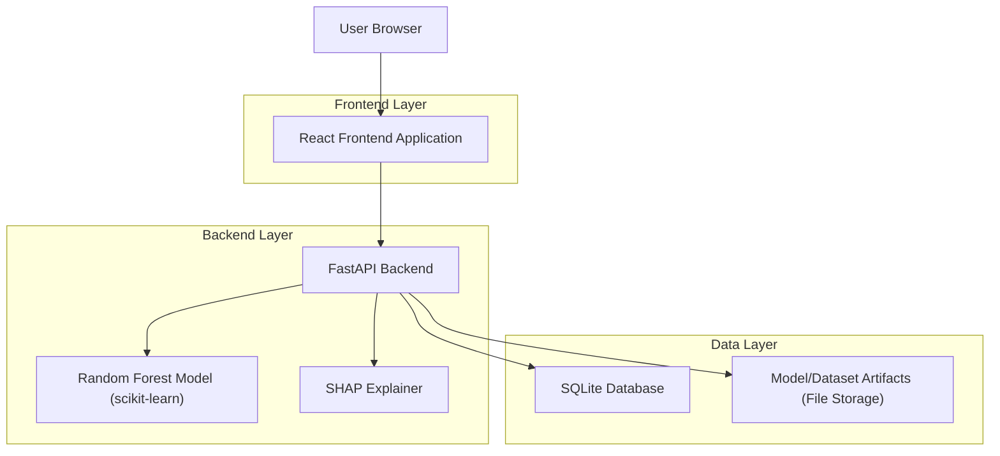
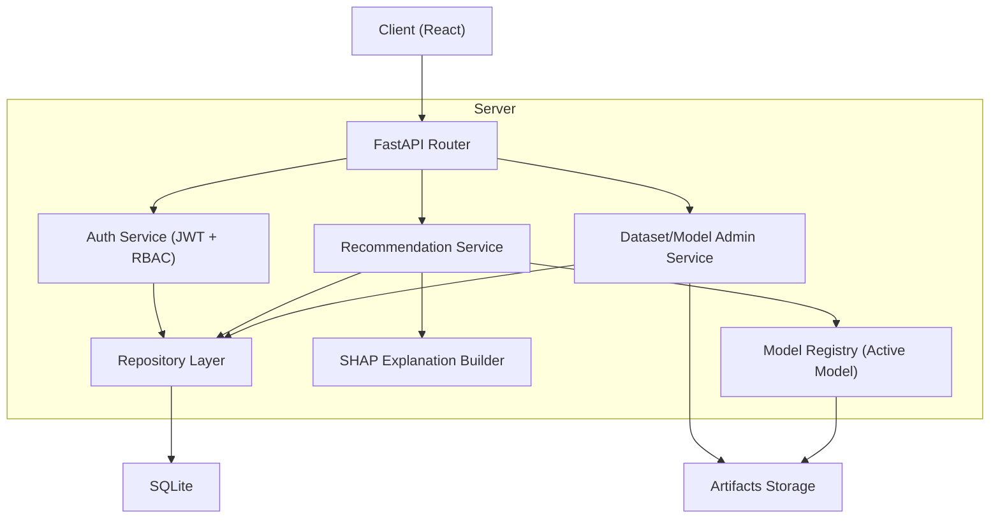
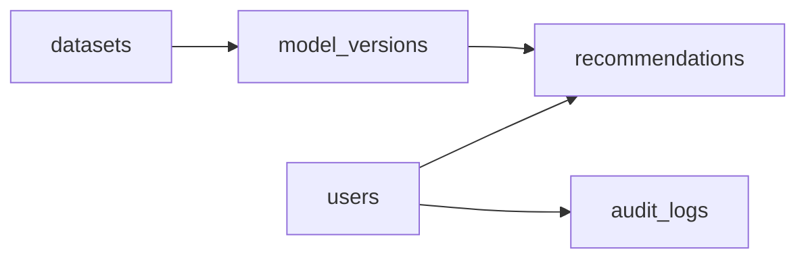

## 1.Architecture design


## 2.Technology Description
- Frontend: React@18 + vite + tailwindcss
- Backend: FastAPI (Python) + pydantic
- ML/XAI: scikit-learn (RandomForest*) + shap
- Database: SQLite
- AuthN/AuthZ: JWT (role-based: Admin/Petani) + password hashing (bcrypt/argon2)

## 3.Route definitions
| Route | Purpose |
|-------|---------|
| /login | Login pengguna dan pembuatan token sesi |
| /dashboard | Ringkasan dan navigasi utama (role-based rendering) |
| /rekomendasi | Form input dan hasil rekomendasi + SHAP |
| /riwayat | Daftar & detail riwayat rekomendasi |
| /admin/data-model | Upload dataset, training, evaluasi, aktivasi model (Admin only) |

## 4.API definitions (If it includes backend services)

### 4.1 Shared TypeScript Types (Frontend)
```ts
export type UserRole = 'ADMIN' | 'PETANI'

export type AuthUser = {
  id: string
  email: string
  role: UserRole
  name?: string
}

export type RecommendationInput = {
  lokasi: string
  jenis_tanah: string
  ph_tanah: number
  curah_hujan_mm: number
  suhu_c: number
  kelembapan_pct: number
  luas_lahan_ha: number
  komoditas?: string
}

export type ShapFeatureContribution = {
  feature: string
  value: number | string
  shap_value: number
}

export type RecommendationResult = {
  id: string
  recommended_musim_tanam: string
  score?: number
  model_version: string
  created_at: string
  shap_top_features: ShapFeatureContribution[]
}
```

### 4.2 Core API

Auth
```
POST /api/auth/login
POST /api/auth/logout
GET  /api/auth/me
```

Rekomendasi
```
POST /api/recommendations
GET  /api/recommendations
GET  /api/recommendations/{id}
```

Admin: Data & Model
```
POST /api/admin/datasets/upload
GET  /api/admin/datasets
POST /api/admin/models/train
GET  /api/admin/models
POST /api/admin/models/{version}/activate
GET  /api/admin/audit-logs
```

Contoh payload pembuatan rekomendasi
```json
{
  "lokasi": "Kec. X",
  "jenis_tanah": "Lempung",
  "ph_tanah": 6.2,
  "curah_hujan_mm": 210,
  "suhu_c": 27.5,
  "kelembapan_pct": 78,
  "luas_lahan_ha": 0.8,
  "komoditas": "Padi"
}
```

## 5.Server architecture diagram (If it includes backend services)


## 6.Data model(if applicable)

### 6.1 Data model definition


Entitas inti:
- users: akun + role.
- recommendations: input, hasil rekomendasi, SHAP ringkas, referensi versi model.
- datasets: file dataset yang diunggah (versi & metadata validasi).
- model_versions: metadata model terlatih + status aktif.
- audit_logs: aktivitas admin penting.

### 6.2 Data Definition Language
Users (users)
```sql
CREATE TABLE users (
  id TEXT PRIMARY KEY,
  email TEXT UNIQUE NOT NULL,
  password_hash TEXT NOT NULL,
  role TEXT NOT NULL CHECK (role IN ('ADMIN','PETANI')),
  name TEXT,
  created_at TEXT NOT NULL,
  updated_at TEXT NOT NULL
);

CREATE INDEX idx_users_role ON users(role);
```

Datasets (datasets)
```sql
CREATE TABLE datasets (
  id TEXT PRIMARY KEY,
  filename TEXT NOT NULL,
  stored_path TEXT NOT NULL,
  schema_json TEXT NOT NULL,
  row_count INTEGER NOT NULL,
  uploaded_by_user_id TEXT NOT NULL,
  created_at TEXT NOT NULL
);

CREATE INDEX idx_datasets_created_at ON datasets(created_at);
```

Model Versions (model_versions)
```sql
CREATE TABLE model_versions (
  version TEXT PRIMARY KEY,
  dataset_id TEXT NOT NULL,
  metrics_json TEXT NOT NULL,
  artifact_path TEXT NOT NULL,
  is_active INTEGER NOT NULL DEFAULT 0,
  created_by_user_id TEXT NOT NULL,
  created_at TEXT NOT NULL
);

CREATE INDEX idx_model_versions_active ON model_versions(is_active);
```

Recommendations (recommendations)
```sql
CREATE TABLE recommendations (
  id TEXT PRIMARY KEY,
  user_id TEXT NOT NULL,
  model_version TEXT NOT NULL,
  input_json TEXT NOT NULL,
  result_json TEXT NOT NULL,
  shap_json TEXT NOT NULL,
  created_at TEXT NOT NULL
);

CREATE INDEX idx_recommendations_user_created ON recommendations(user_id, created_at);
```

Audit Logs (audit_logs)
```sql
CREATE TABLE audit_logs (
  id TEXT PRIMARY KEY,
  actor_user_id TEXT NOT NULL,
  action TEXT NOT NULL,
  detail_json TEXT NOT NULL,
  created_at TEXT NOT NULL
);

CREATE INDEX idx_audit_logs_created_at ON audit_logs(created_at);
```