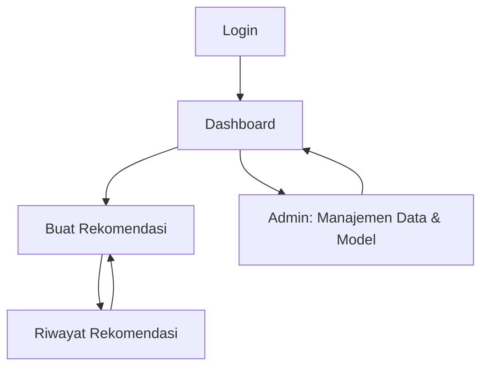

## 1. Product Overview
Sistem web yang membantu Petani menentukan rekomendasi musim tanam berbasis model Random Forest.
Admin mengelola data latih, pelatihan model, dan memantau kualitas rekomendasi, lengkap dengan penjelasan SHAP.

## 2. Core Features

### 2.1 User Roles
| Role | Registration Method | Core Permissions |
|------|---------------------|------------------|
| Petani | Dibuat Admin (atau self-register jika diaktifkan) | Mengisi parameter lahan, melihat rekomendasi musim tanam dan penjelasan, menyimpan & melihat riwayat rekomendasi |
| Admin | Seed awal / dibuat Admin lain | Mengelola user, mengunggah & memvalidasi dataset, melatih & versi model, melihat metrik evaluasi dan audit aktivitas |

### 2.2 Feature Module
Produk ini terdiri dari halaman inti berikut:
1. **Login**: autentikasi, pemilihan/validasi role.
2. **Dashboard**: ringkasan cepat sesuai role (Petani/Admin), akses cepat ke fitur utama.
3. **Buat Rekomendasi**: formulir input kondisi lahan/iklim, hasil rekomendasi, penjelasan SHAP, simpan hasil.
4. **Riwayat Rekomendasi**: daftar riwayat, detail rekomendasi & penjelasan.
5. **Admin: Manajemen Data & Model**: unggah dataset, pelatihan model, evaluasi, kelola versi model.

### 2.3 Page Details
| Page Name | Module Name | Feature description |
|-----------|-------------|---------------------|
| Login | Form login | Meminta email/username dan password, menampilkan pesan error yang jelas, mengarahkan ke Dashboard setelah sukses |
| Dashboard | Ringkasan peran | Menampilkan kartu ringkas (jumlah rekomendasi terakhir untuk Petani / status model aktif & metrik untuk Admin), tombol cepat menuju fitur utama |
| Dashboard | Navigasi utama | Menyediakan menu ke Buat Rekomendasi, Riwayat, dan Manajemen Data & Model (hanya Admin), serta tombol Logout |
| Buat Rekomendasi | Form input | Mengumpulkan parameter minimal untuk inferensi (contoh: lokasi/kecamatan, jenis tanah, pH, curah hujan, suhu, kelembapan, luas lahan, komoditas target jika ada), validasi input, dan submit ke layanan rekomendasi |
| Buat Rekomendasi | Hasil rekomendasi | Menampilkan musim tanam yang direkomendasikan + ringkasan alasan, tingkat keyakinan/score (jika tersedia), dan saran tindak lanjut dasar |
| Buat Rekomendasi | Penjelasan SHAP | Menampilkan fitur paling berpengaruh (top-N) dalam bentuk grafik bar sederhana dan tabel nilai kontribusi, dengan teks penjelasan singkat yang mudah dipahami |
| Buat Rekomendasi | Simpan hasil | Menyimpan hasil rekomendasi beserta input dan versi model yang dipakai ke riwayat pengguna |
| Riwayat Rekomendasi | Daftar riwayat | Menampilkan daftar rekomendasi (tanggal, ringkasan input, hasil), pencarian sederhana (berdasarkan tanggal/lokasi), dan akses ke detail |
| Riwayat Rekomendasi | Detail riwayat | Menampilkan input lengkap, output rekomendasi, penjelasan SHAP, serta versi model yang digunakan |
| Admin: Manajemen Data & Model | Upload dataset | Mengunggah dataset (CSV), validasi kolom wajib, menampilkan ringkasan (jumlah baris, missing value), dan menyimpan sebagai dataset versi tertentu |
| Admin: Manajemen Data & Model | Training & versi model | Menjalankan pelatihan Random Forest dari dataset terpilih, menyimpan artefak model sebagai versi baru, dan menetapkan model aktif |
| Admin: Manajemen Data & Model | Evaluasi | Menampilkan metrik evaluasi utama (mis. akurasi/F1 untuk klasifikasi atau RMSE untuk regresi—sesuai target), confusion matrix/plot sederhana jika relevan |
| Admin: Manajemen Data & Model | Audit ringkas | Menampilkan log aktivitas penting (unggah dataset, train, aktivasi model, perubahan user) |

## 3. Core Process
**Alur Petani**
1) Login.
2) Dari Dashboard pilih “Buat Rekomendasi”.
3) Isi parameter lahan/iklim lalu submit.
4) Sistem menampilkan rekomendasi musim tanam + penjelasan SHAP.
5) Petani menyimpan hasil dan dapat membuka kembali lewat “Riwayat Rekomendasi”.

**Alur Admin**
1) Login.
2) Buka “Manajemen Data & Model”.
3) Upload dataset dan cek validasi ringkas.
4) Jalankan training untuk membuat versi model baru.
5) Tinjau metrik evaluasi lalu tetapkan model aktif.

